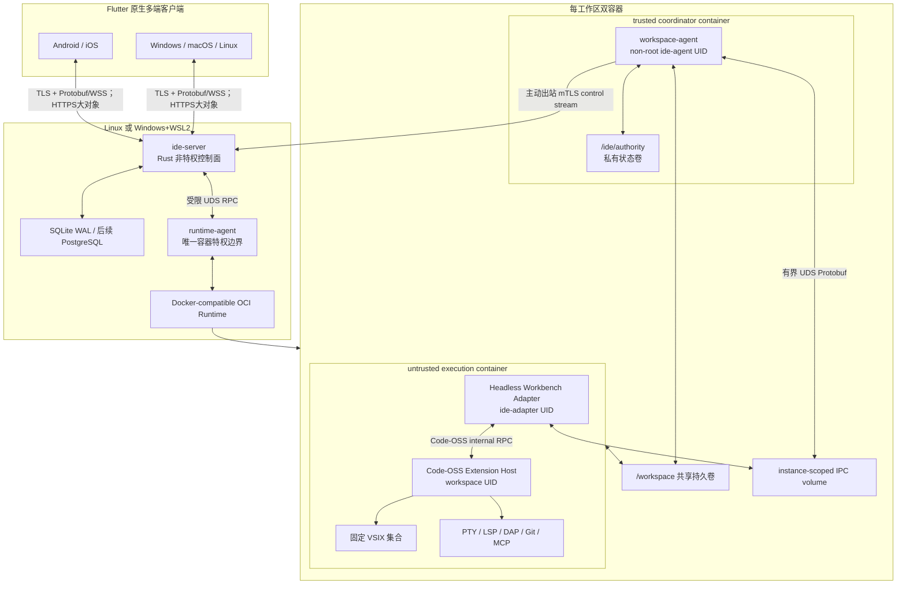
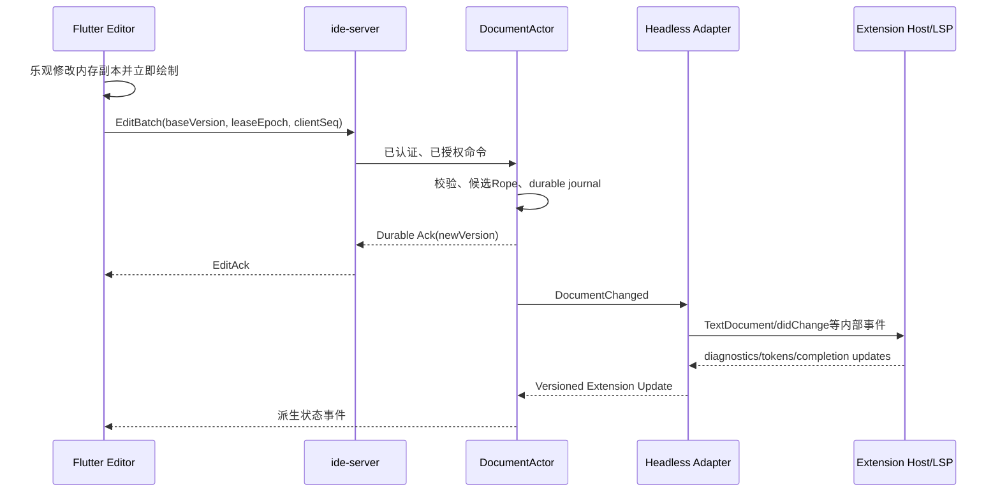

# 当前目标架构

> 状态：产品约束 frozen；技术实现 planned。本文只描述目标架构，不声称已运行。

## 1. 系统边界

项目由五个运行部分构成：

| 部分 | 运行位置 | 技术 | 职责 | 明确不负责 |
|---|---|---|---|---|
| Flutter Client | Android/iOS/Windows/macOS/Linux | Dart/Flutter | 原生编辑器、文件树、语言 UI、终端渲染、SCM、调试、Agent、状态同步 | 项目持久化、VSIX、Shell、LSP/DAP、Git执行 |
| IDE Control Plane | Linux或Windows的WSL2 | Rust | 认证、连接、工作区元数据、状态同步、长操作、审计、路由 | 直接持有容器引擎socket、执行用户代码 |
| Runtime Agent | Linux或WSL2 | Rust、最小特权 | 容器、卷、配额、网络、暂停、对账 | 对外网络、用户协议、业务认证 |
| Workspace Coordinator | 每工作区独立可信容器 | Rust Workspace Agent | 已ACK文档事实源、协调写入、外部写归并、导出准备与执行侧监管 | 执行项目代码、宿主管理、跨工作区访问 |
| Workspace Execution | 每工作区独立非可信容器 | Code-OSS TypeScript + Node.js | Headless Adapter、Extension Host、固定VSIX、PTY/LSP/DAP/Git/Agent工具 | Flutter渲染、插件管理市场、Webview、authority状态访问 |

## 2. 总体拓扑



Windows部署额外增加 `ide-host.exe`：它以专用非交互 Windows service identity 启动并拥有指定 WSL2 发行版、维护稳定端口转发、检查版本与健康状态。业务 TLS 在 WSL2 的 `ide-server` 终止；Windows Host只做字节转发和生命周期管理。发行版禁用 DrvFs automount、Windows interop 和 Windows PATH 注入；除 Gateway 外服务仅监听 UDS/loopback，Windows Firewall 阻断从 WSL 网络绕过 Gateway 的直连。VHD/发行版删除必须精确匹配登记的 distribution id、路径和generation，未知资源只隔离不删除。

## 3. 单一事实源

| 状态 | 权威拥有者 | Flutter可保存内容 |
|---|---|---|
| 已ACK文档内容与版本 | Workspace Agent / DocumentActor | 当前视图副本和未ACK输入 |
| 项目卷原始文件 | 冻结时的文件系统；运行时由 Workspace Agent 侦测归并 | 文件树/内容投影 |
| 文档版本、保存版本、冲突 | DocumentActor | 最后确认版本 |
| 扩展激活、注册命令、诊断、语言能力 | Headless Adapter + Extension Host | 版本化派生快照 |
| 工作区生命周期 | IDE Control Plane | 状态快照 |
| 终端进程与scrollback | Workspace Agent | 可见窗口 |
| Agent任务与工具调用 | Workspace Agent / Agent Orchestrator | 事件游标和可见消息 |
| 用户工作区偏好 | Control Plane State Sync | 缓存副本 |
| 光标、选择、滚动、窗口布局 | 设备本地 | 完整本地状态 |

Flutter不得形成第二套可变项目状态。它采用与 ModCptLib 类似但适合远程连接的模式：

```text
命令：Flutter → Rust
数据：Flutter ← Versioned Snapshot
变化：Flutter ← Ordered Typed Event
恢复：Cursor Replay 或 Snapshot Required
```

## 4. 编辑数据路径

### 4.1 用户输入



客户端不等待服务端再绘制字符，但只有 `EditAck` 表示编辑已被服务端持久接受。ACK前断线的编辑留在有界内存队列；超过离线宽限、队列上限或租约失效时，编辑器转只读并要求恢复/另存草稿，不能显示为已保存。

### 4.2 插件或Agent修改

```text
Extension/Agent WorkspaceEdit
  -> Headless Adapter
  -> Workspace Agent生成不可变candidate ID + digest + base版本
  -> Flutter候选 Diff / 策略要求的审批
  -> 带workspace generation、digest和逐资源LeaseFence的Apply命令
  -> Workspace Agent Mutation Broker
  -> DocumentActor（打开文档）或安全文件事务（关闭文档）
  -> Durable revision
  -> Extension Host + 全部 Flutter客户端
```

Completion、Rename、Formatting与Code Action请求本身只生成preview candidate，没有写副作用。只有显式`ApplyWorkspaceEdit`通过Mutation Broker后才提交；候选过期、digest/base/extension generation、create/rename/delete的精确source/target `FilePrecondition`或任一LeaseFence变化都拒绝，不允许先写后批，option flag也不能把竞态变成成功。

直接磁盘写入无法完全禁止，因为插件子进程、Git和编译器可写文件。文件监视器以内容哈希复核：干净文档变成外部版本；存在未保存编辑时生成冲突候选并停止自动覆盖。

## 5. Code-OSS Extension Host边界

Extension Host不是可独立使用的稳定公共库。项目必须：

1. 固定 Code-OSS完整 commit、Node版本、构建参数和补丁集。
2. 从同一源码构建 Extension Host与Main Thread侧适配器。
3. 将所有 Code-OSS内部类型限制在 `code-oss/headless-adapter`。
4. 通过自有稳定IPC把文档、UI、终端、SCM、调试和Agent事件投影给Rust。
5. 每次上游升级运行同 commit 纯 Node reference harness、API fixture/golden、第三方扩展矩阵和拒绝测试。

兼容目标是“服务器工作区扩展和可映射UI扩展”，不是复制整个 VS Code桌面产品。零 Electron/Chromium 是跨仓库、构建与发布的硬边界：依赖图、CI、测试/开发工具、安装包、容器镜像、运行时、SBOM与发布工件都不得下载、安装、携带或启动 Electron、Chromium、Chromedriver、`@vscode/test-electron`、Playwright、Puppeteer、Electron shell、Chromium sidecar、WebView或隐藏浏览器。只允许 exact commit 的纯 Node.js Extension Host、最小源码闭包和经审计的 Headless Adapter；完整上游源码只能只读提取，不能把浏览器二进制或依赖带入发布图。若最小构建强制依赖任一禁用组件，G0 直接 No-Go。详细等级见 `CODE_OSS_EXTENSION_HOST.md`。

验收执行面同样是架构边界：权威证据必须能在本机Windows与自管Linux上针对最终clean commit离线重放。GitHub Actions或其他托管/远程CI只允许作为同一命令的可选镜像，不是控制面、事实源或`accepted`前置；不可用、未配置或未运行远程CI不得单独改变阶段状态。

G0-07 已验证这一边界可实现：exact clean Code-OSS源码只读输入经自有AST闭包构建器生成843个Node ESM模块，Linux运行依赖为10 direct/54 total，tracked upstream patch为0；inventory、CycloneDX、native/link omission和进程树负向门均绑定该产物。该证据支持G0技术Go，不改变Execution不可信边界，也不把Spike提升为产品Runtime。

系统浏览器仅是客户端外置 OIDC Authorization Code + PKCE 的用户代理，不嵌入 Flutter、不由服务端启动为渲染器，也不随产品分发。它不是上述禁令的产品组件例外。

## 6. 工作区与容器

工作区记录采用 desired/observed状态：

```text
Desired: absent | stopped | running

Observed:
absent → provisioning → stopped → starting → ready
                                   ↘ degraded → failed
ready → stopping → stopped
```

每次替换容器增加 `runtime_generation`。容器、Extension Host、文件监视器和任务的所有事件都携带 generation；旧实例的迟到事件被拒绝。

容器目录：

```text
/workspace               项目持久卷
coordinator container:
  /workspace             项目持久卷（rw）
  /ide/authority         Agent私有document journal/checkpoint（rw,0700）
  /ide/ipc               instance-scoped IPC volume（rw）
  /tmp                   有硬限额的tmpfs

execution container:
  /workspace             同一项目持久卷（rw）
  /ide/code-oss          固定只读Code-OSS
  /ide/headless-adapter  固定只读适配器
  /ide/extensions        固定只读扩展集
  /ide/extension-state   插件状态卷（rw，不含authority）
  /ide/ipc               同一IPC volume（仅连接指定socket）
  /run/ide-credentials   每执行进程短期broker endpoint
  /tmp                   有硬限额的tmpfs
```

两个容器均以非root运行、根文件系统只读、drop all capabilities、`no-new-privileges`、seccomp、资源限额和独立PID/mount namespace。Coordinator不安装Node、shell或项目工具；Execution永远不挂载authority volume、运行时socket或控制面secret。共享IPC socket按workspace/runtime generation创建，校验随机启动nonce、协议hash和预期应用身份；若底层跨容器`SO_PEERCRED`不能可靠映射，则在UDS上使用每实例双向challenge key，仍不退回裸TCP。Execution是可单独pause/kill/重建的writer边界，不依赖容器内动态cgroup切换。

双容器隔离仍共享宿主内核和可写项目卷，不能抵抗内核逃逸，也不能使同一Execution中的扩展彼此隔离。首版适合受信任组织/自托管；强敌对多租户使用独立VM或microVM。

Extension Host、终端和构建进程可直接写 `/workspace`，无法靠 VS Code API 完全拦截。结构化编辑仍由 DocumentActor 权威 ACK；直接写被 watcher 以 metadata/inode/hash 复核并提升为 external-change version，若与 dirty 文档重叠则进入显式冲突。项目不能宣称原始文件系统的所有写入都经过单一API。

## 7. 多端状态同步

首版的“多端”严格指同一workspace owner的多设备；只有一名交互principal共享一个ExtHost/extension-state/SecretStorage。不同principal attach在Gateway即拒绝，未来跨用户协作必须按`(user, workspace)`建立独立Workbench执行边界。

不使用一个全局高争用序号承载所有数据，按流恢复：

| 流 | 游标 |
|---|---|
| 工作区控制 | 独立`event_sequence` |
| 文档 | 独立`event_sequence`；canonical/saved version在payload |
| 终端 | 独立`event_sequence`；raw byte offset在output payload |
| Agent任务 | 独立`event_sequence` |
| Extension贡献 | `extension_generation + event_sequence`；contribution revision在payload |

重连结果只有三类：增量重放、需要完整快照、流不可用/无权限。创建快照和登记live tail在同一Actor barrier完成：snapshot携带event high-watermark，只接续严格大于watermark的事件。Snapshot chunk使用独立snapshot ID/index，不占事件序号；客户端验hash并原子安装、发送`SnapshotInstalled`后才接tail。ACL在恢复途中撤销会取消replay、清空未发送队列并关闭会话，不再投递后续内容。数据队列为control frame预留独立额度；若连reset也无法发送则直接关闭，并在下次Hello强制snapshot。

ACK丢失的编辑按 `(user_id, device_id, client_instance_id, workspace_id, document_id, client_sequence)` 持久去重；同一客户端实例跨会话重连继续sequence，新进程使用新`client_instance_id`。键不能仅使用客户端自报的自由字符串。

首版同一文档采用写入租约。多设备可观察，只有持有当前 `workspace_generation + lease_epoch` 的客户端可提交；租约转移后旧设备的迟到编辑全部拒绝。Control Plane、Workspace Agent、容器或WSL重启后所有瞬时租约失效，新generation/epoch从持久计数器提升，不能用重启后的单调时钟延续旧TTL。终端输入和调试控制使用独立租约。

所有延迟生效命令携带精确epoch而非只检查“当前客户端仍是holder”：Save/Revert/SetLanguage绑定document lease epoch，策略要求Workbench控制的ExecuteCommand绑定workbench lease epoch，并在长操作最终commit再次校验，避免失去后重获产生ABA。

## 8. 长操作

以下任务统一使用 `operation_id`：工作区创建/启动/重建、Extension Host启动、Agent任务、导入/导出、索引、数据库迁移和WSL更新。

```text
running → cancelling → cancelled
running/cancelling → succeeded | failed | deadline_exceeded
```

终态恰好一次。`CancelOperation`必须携带当前`expected_operation_revision`并重新校验operation owner或该kind权限；cancel与commit使用同一持久比较交换/事务仲裁，旧revision只返回冲突或首次已持久结果。取消顺序必须是停止准入、通知子任务、回滚/完成原子单元、释放资源、验证资源归零、提交终态、发布事件。调用方断开不等于取消。

## 9. 项目导出

首版使用可证明一致的短暂停写导出，而不是宣称底层文件系统具备在线快照：

1. Control Plane中的durable Export Coordinator写入export phase、workspace/runtime generation、fencing token和deadline；Runtime Agent先取得generation/fencing-bound volume operation lock并返回持久handle，Coordinator记录成功后才暂停新mutation/exec/terminal input/Agent/扩展命令准入。
2. 持锁的Runtime Agent冻结整个Execution容器；Coordinator容器中的Workspace Agent仍运行。
3. Workspace Agent排空watcher并归并direct write，保存全部已确认文档、fsync项目和authority DB，返回prepare watermark/tree metadata。
4. Runtime Agent校验token后冻结Coordinator容器。被冻结的Workspace Agent不再承担归档或恢复owner。
5. Runtime Agent启动digest锁定的临时Exporter Helper容器；它是导出期第三容器，不属于steady-state工作区双容器。Helper无网络/authority/control socket、只读根、drop-all/seccomp，只挂载RO workspace volume和有界scratch；它继承已持锁operation的受限只读执行上下文但绝不拥有/释放lock，执行卷级`syncfs`/等价flush，校验路径/类型/大小/数量，生成 `.partial` 归档、manifest和SHA-256。Runtime Agent不直接宿主挂载读取项目。
6. 成功路径等待helper关闭全部FD并达到terminal，再fsync/原子publish；失败路径先cancel helper→wait terminal→关闭只读mount。两条路径都先解冻Coordinator，由Workspace Agent按watermark对账，再解冻Execution，Control Plane最后解除准入。
7. 返回一次性exchange凭据；客户端换取绑定user/device/export/hash/长度/TTL且可多Range续传的短期download session，每个Range重新校验ACL与撤销状态。

每个阶段幂等持久化。Runtime Agent watchdog和Control Plane reconciler必须根据operation、Coordinator/Execution/Helper component label与实际pause/mount状态恢复；pause token超时、控制面断连或任一进程崩溃都触发安全解冻、artifact失败与`.partial`隔离。同卷export/import/backup/migrate/delete/stop使用互斥volume operation lock，不能把恢复责任留给已暂停的容器进程。

volume lock释放证据区分helper从未启动（Runtime Agent回读无helper容器、mount、FD）与helper已启动且terminal/mount全部关闭；不能强迫pre-helper失败伪造terminal证据，也不能用调用方布尔值释放锁。Runtime stop/destroy同样必须绑定expected generation；destroy另带registered runtime/volume identity和deletion fencing token，未知资源只隔离、不删除。

默认排除`/ide`、secret、socket、临时凭据和内部状态。ZIP用于普通跨平台导出；`tar.zst`保留Unix权限；`git bundle`单独提供已提交refs/history，不包含未提交working tree。

## 10. Runtime Release原子版本

以下内容必须作为一个发布和兼容单位：

```json
{
  "runtimeRelease": "<semver>",
  "codeOssCommit": "<full commit>",
  "nodeVersion": "<exact>",
  "headlessAdapterProtocol": 1,
  "publicProtocolMajor": 1,
  "coordinatorImageDigest": "sha256:<digest>",
  "executionImageDigest": "sha256:<digest>",
  "exporterHelperDigest": "sha256:<digest>",
  "wsl2RootfsDigest": "sha256:<digest-or-null-on-linux>",
  "extensionsLockSha256": "<digest>",
  "storageSchema": 1
}
```

不在兼容矩阵中的组合在加载插件、恢复状态或写工作区前失败，不做隐式降级。

## 11. 明确非目标

- Flutter Web客户端和浏览器编辑器。
- WebView、Monaco或Code-OSS Workbench UI复用。
- Windows工作区或Windows容器工具链。
- 用户插件市场、运行时插件安装、任意VSIX上传。
- Webview、Custom Editor、Notebook完整兼容，或任何 Electron/Chromium/WebView/隐藏浏览器依赖。
- 第一版多人同时写同一文档。
- 客户端离线本地工程和本地编译。
- 在仓库依赖、CI、测试/开发工具、安装包、镜像、运行时或发布工件中下载、安装、打包或启动 Chromium/Electron；通过隐藏浏览器伪装无WebView兼容。
- 将容器隔离描述为恶意多租户的VM级安全边界。
