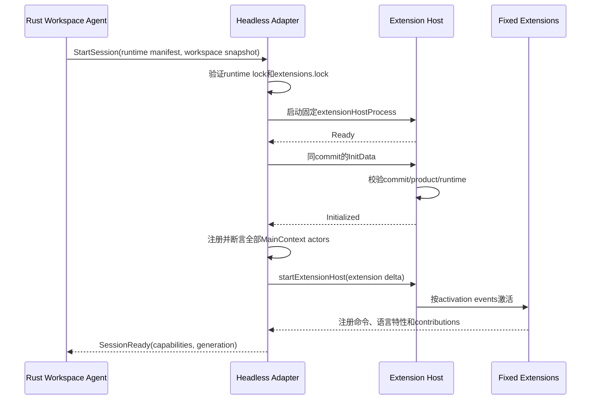

# Code-OSS Extension Host 与 Headless Workbench Adapter

> 状态：planned；项目最高技术风险。`G0` 可行性门通过前，不得宣称插件兼容已成立。

## 1. 核心结论

无 WebView 的 Flutter 客户端可以保留 Code-OSS Extension Host，但必须在服务端补齐 Workbench “主线程一侧”的无界面实现：

```text
VS Code Extension
  -> vscode API
  -> Code-OSS Node Extension Host
  -> Code-OSS internal MainThread/ExtHost RPC
  -> Headless Workbench Adapter（Node/TypeScript）
  -> 稳定有界的产品协议
  -> Rust Workspace Agent / Document Service
  -> Flutter 原生 UI
```

强制边界：

1. Rust不得直接实现、解析或持久化 Code-OSS内部 Extension Host RPC。
2. `ExtensionHostMain`、RPC protocol、Main/ExtHost contexts、扩展扫描和激活必须来自同一固定 Code-OSS commit。
3. Adapter吸收上游内部变化，只向Rust暴露版本化产品协议。
4. 兼容目标是 VS Code Extension API 的可支持子集，不是所有扩展UI。
5. 第一版一个工作区只有一个逻辑Workbench Session、一个Adapter和一个Extension Host；一个客户端持有控制租约，其他客户端观察。

官方架构本身将 workspace extensions 放在远程 Node.js Extension Host 中运行，但官方并未承诺其内部 MainThread/ExtHost RPC 是第三方稳定接口。[Extension Host](https://code.visualstudio.com/api/advanced-topics/extension-host)、[远程扩展](https://code.visualstudio.com/api/advanced-topics/remote-extensions)

## 2. 进程与所有权

```text
coordinator container             可信、non-root
└── workspace-agent               Rust；文档事实/协议监督

execution container               不可信、non-root
└── headless-workbench             Node/TypeScript
    └── extensionHostProcess       固定Code-OSS构建
        ├── language servers
        ├── debug adapters
        ├── test runners
        └── extension child processes
```

- Adapter退出：Execution容器内init终止成对Extension Host；Runtime Agent按Workspace Agent/Control Plane的desired state有界重建Execution。
- Extension Host退出或无响应：指数退避；超过阈值将工作区标记为 `extension_host_degraded`。
- Adapter与Rust只通过instance-scoped共享IPC volume上的UDS通信；socket按专用跨容器组最小授权，并使用每generation双向challenge/协议hash认证，不能仅依赖容器UID映射。
- Code-OSS内部RPC只存在于父子进程IPC，不绑定TCP端口。
- 所有Node及其子进程都在Execution容器的cgroup/PID/内存/FD限额内，可整体pause/recreate；它们无法看到Coordinator PID/authority volume。
- 每次重启增加 `extension_generation`；旧generation事件被Rust拒绝。

## 3. Code-OSS复用边界

### 3.1 同commit构建并尽量原样复用

- Node Extension Host进程与`ExtensionHostMain`。
- `ExtensionHostManager`、RPC protocol、Main/ExtHost context与customer注册机制。
- 扩展扫描、manifest解析、依赖、激活事件、`vscode`模块注入。
- Extension Context、Memento、SecretStorage契约。
- URI、Range、Position、Event、Disposable、CancellationToken等公共原语。
- 无DOM的文本模型、语言选择器、TextMate grammar、snippet、theme和language configuration解析能力。

### 3.2 适配或重新提供

- Extension Host启动器与init data工厂。
- product/environment/configuration/workspace/storage/log/telemetry服务。
- 文件系统、文档、编辑器上下文和bulk edit。
- MainThread UI actors、context keys、menus、commands。
- Terminal、Task、SCM、Debug、Testing。
- Authentication、SecretStorage、URI callback。
- Chat、Language Model Tool与MCP。

### 3.3 完全排除运行路径

- Electron BrowserWindow和桌面Workbench入口。
- DOM Workbench与Monaco可视化编辑器。
- Browser/WebWorker Extension Host。
- HTML QuickPick、Dialog、Notification和Webview renderer。
- Custom Editor与HTML Notebook renderer。
- Marketplace/插件安装/自动更新UI。
- Service Worker、Electron clipboard/window/menu实现。
- `@vscode/test-electron`、Playwright、Puppeteer、Chromedriver、Electron shell、Chromium sidecar及任何会下载或启动浏览器的测试/开发工具。

不要导入完整 `workbench.desktop.main` 或 `workbench.web.main` 再隐藏UI。应创建独立Node入口，只显式装配已分类的MainThread actors与无DOM服务。

以上不是只针对产品运行时的兼容性声明，而是供应链合同：仓库依赖图、lockfile、CI、测试、开发工具、安装包、容器镜像、SBOM、运行时和发布工件都不得下载、安装、打包或启动 Electron/Chromium。完整上游源码可在隔离的只读提取步骤中按 exact commit 使用，但浏览器二进制、相关 package dependency 和构建缓存不得进入项目 dependency graph、镜像、SBOM或发布物。最小 Extension Host 源码闭包若无法在此边界内构建，G0 立即 No-Go，不得用隐藏浏览器降级。

## 4. 代码组织

```text
code-oss/
├── upstream/                         固定submodule或vendor镜像
├── patches/                          最小、可重放补丁
├── runtime-lock.json
├── extensions.lock.json
├── actor-capabilities.yaml
├── contribution-capabilities.yaml
├── headless-adapter/
│   ├── src/bootstrap/headlessWorkbenchMain.ts
│   ├── src/extensionHost/
│   │   ├── headlessNodeExtensionHost.ts
│   │   └── initDataFactory.ts
│   ├── src/customers/
│   │   ├── core/ editor/ ui/ terminal/
│   │   ├── scm/ debug/ testing/ agent/
│   │   └── unsupported/
│   ├── src/services/
│   │   ├── documentReplicaService.ts
│   │   ├── workspaceService.ts
│   │   ├── storageService.ts
│   │   ├── secretService.ts
│   │   ├── contextKeyService.ts
│   │   └── flutterUiBridge.ts
│   ├── src/contributions/
│   └── test/
├── tools/
│   ├── generate-actor-inventory.ts
│   ├── generate-contribution-inventory.ts
│   ├── verify-code-oss-drift.ts
│   ├── inspect-extension.ts
│   └── generate-runtime-lock.ts
└── extension-fixtures/
    ├── core-api/ language-api/ native-ui-api/
    ├── workflow-api/ agent-api/ unsupported-api/
    └── crash-and-resource-api/
```

## 5. 启动时序



Init data至少包含：精确commit、product/version、workspace folders、配置快照、扩展描述、日志/存储/扩展目录、remote name、环境变量白名单、Workspace Trust、telemetry policy、URI scheme和Node信息。

首版运行位置规则：

- 有`main`的Node workspace extension：候选支持。
- 同时有`main`和`browser`：使用`main`。
- browser-only：不运行。
- `extensionKind: ["ui"]`代码扩展：不运行。
- 纯声明式theme/grammar/snippet：由Adapter消费。
- proposed API：默认拒绝，只能在runtime lock中按扩展ID和API精确allowlist。

## 6. Actor清单必须穷尽

维护机器可读清单：

```yaml
MainThreadDocuments:
  implementation: adapted
MainThreadLanguageFeatures:
  implementation: reused
MainThreadQuickOpen:
  implementation: flutter_bridge
MainThreadWebviews:
  implementation: unsupported
```

升级时从固定commit的协议源生成actor/method inventory。任何新增、删除或签名变化都让CI失败，直到明确分类；不能缺少代理后等插件运行时随机报错。

### 6.1 C0：核心无界面能力

优先实现：

- Extension Service、Commands、Configuration、Workspace。
- FileSystem、FileSystem Events、Search。
- Documents、Content Providers、Text Editors、Bulk Edits。
- Languages、Language Features、Diagnostics。
- Storage、Secret State、Logger、Console、Errors、Localization。

Adapter内文本模型只是可重建副本和语言调度器，Rust DocumentActor仍是权威。

### 6.2 C1：Flutter原生UI映射

- Message、QuickPick/InputBox、Dialogs、Progress。
- StatusBar、Window、VS Code `env.clipboard`、URL/URI openers。
- TreeViews、Decorations、Editor Tabs、Output、Terminal、Task。
- Commands、Menus和Context Keys。

映射示例：

```text
showQuickPick
  -> UiRequest.QuickPick
  -> Rust路由至控制客户端
  -> Flutter原生Sheet/Dialog
  -> UiResponse
  -> 完成原vscode API Promise
```

无在线控制客户端时，交互Promise必须在明确超时后以稳定错误结束，不能永久挂起。

Clipboard不复用Electron实现：Adapter发出typed UI request，只能由当前控制客户端在设备权限与用户会话策略允许时完成；拒绝或无在线客户端返回稳定错误。Progress、Output与Task各有可恢复stream，大内容使用分页或统一snapshot transfer，不能塞进单个UI frame。

`commands.executeCommand`不等于拥有所有产品能力。构建期从固定扩展manifest和管理员策略生成可信command policy registry；每个`CommandDescriptor`携带服务端policy digest及所需capability/permission、Workspace Trust、Workbench控制和effect类别。客户端执行时回传digest，Rust重新校验动态并集；未知/漂移/未分类command拒绝。扩展运行时声明不作为授权事实，命令引发的BulkEdit、Task、Terminal、Debug或SCM仍进入对应Broker。

### 6.3 C2：开发工作流

- SCM、Debug、Testing。
- Comments、Timeline、Authentication、URI callback。

### 6.4 C3：Agent扩展能力

- Language Model providers/tools。
- Chat Participants/Sessions。
- MCP、Code Mapper、Document Diff、Agent Comments。

工具注册：

```text
Extension registerTool
 -> Extension Host
 -> Adapter Tool Registry
 -> Rust Agent Orchestrator
```

工具调用：

```text
Rust Agent Orchestrator
 -> Adapter InvokeTool
 -> Extension Tool implementation
 -> typed result / confirmation / error
```

Chat的进度块、引用、候选变更、确认和终态必须转换为Flutter可消费的typed events。

### 6.5 U：明确不支持

- Webviews/WebviewPanels/WebviewViews。
- Custom Editors、Editor Insets。
- HTML Notebook renderer/Interactive Window。
- Browser View和HTML Chat output renderer。

这些actor使用具名stub，调用时返回：

```text
code = extension_api_not_supported
extension_id
actor
method
runtime_release
documentation_key
```

禁止silent no-op。

## 7. 文档双模型

```text
Rust DocumentActor（权威）
├── URI
├── canonical version
├── saved version
├── Rope/Piece Table
└── durable operation log

Adapter Text Model（可重建副本）
├── URI
├── adapter model version
├── canonical version mapping
├── language id
└── ExtHost document/editor handles
```

位置统一为0-based line和UTF-16 code unit column。所有Adapter事件携带canonical version与source operation ID。

### 7.1 Flutter编辑

```text
Flutter乐观回显
 -> Rust校验并durable commit
 -> DocumentChanged(canonicalVersion)
 -> Adapter更新text model
 -> ExtHost onDidChangeTextDocument
 -> language providers更新
```

### 7.2 Extension WorkspaceEdit

```text
Extension -> MainThreadBulkEdits
  -> 不可变CandidateWorkspaceEdit ID + digest + text base及resource source/target前置条件
 -> Flutter按策略展示Diff/取得审批
 -> ApplyWorkspaceEdit(CommandMeta + digest + LeaseFences)
 -> Rust重新校验版本、权限、generation、TTL和审批
 -> DocumentActor原子应用
 -> Adapter更新text models
 -> 全部客户端同步
```

### 7.3 保存

```text
Save command
 -> Rust创建SaveOperation
 -> Adapter调用willSave participants（有硬超时）
 -> 收集有界waitUntil edits
 -> Rust应用并写卷
 -> ExtHost onDidSave
```

Node扩展可以直接使用`fs`或`child_process`，无法被VS Code API拦截。项目依靠固定扩展审计、容器隔离和文件watcher处理；不能宣称一个Extension Host内的扩展彼此安全隔离。

## 8. 声明式Contribution

Adapter扫描并处理：

- languages、grammars、snippets、themes、icon themes。
- commands、menus、keybindings、configuration。
- views、viewsContainers。
- debuggers、breakpoints、taskDefinitions、problemMatchers。
- semanticTokenScopes、languageModelTools。

维护`contribution-capabilities.yaml`，构建镜像时静态检查固定插件manifest。不支持的必需contribution阻止该扩展进入Certified集合。

TextMate grammar继续在服务端按VS Code contribution解析，semantic token由Extension Host provider产生；合并为版本化style spans后传给Flutter。不能换成另一套语法系统后仍宣称兼容VS Code grammar插件。

## 9. Adapter到Rust协议

使用UDS + 长度前缀Protobuf；控制帧、大文档、终端、测试输出和Agent输出均有独立硬上限和有界队列。协议至少包含：

```text
AdapterHello
DocumentSnapshot / DocumentEvent
UiRequest / UiResponse
LanguageRequest / LanguageResponse
ContributionSnapshot / ContributionDelta
TerminalChunk
ExtensionLifecycleEvent
AgentToolEvent
CancelOperation
PublicError
```

规则：

- UUID operation/request ID。
- deadline与cancel。
- operation恰好一个终态。
- 文档canonical version。
- 工作区或contribution单调sequence。
- major不兼容时副作用前拒绝。
- Adapter重启后Rust发送快照，不依赖无限事件重放。
- 队列满时`resource_exhausted`，不无界缓存。

## 10. 多端语义

VS Code API中的`activeTextEditor`、visible editors、selections、tab groups、active terminal和clipboard没有`client_id`。因此第一版：

这里的`user`固定为工作区owner；同一owner可有多个设备，但不同principal不得attach这个Workbench或读取其Memento/SecretStorage。跨用户协作只有在未来按`(user, workspace)`拆分Adapter、Extension Host、extension-state和secret后才可开启。

```text
一个user + workspace
└── 一个Headless Workbench Session
    └── 一个Extension Host
        ├── 一个控制客户端
        └── 多个观察客户端
```

控制客户端决定插件可见的active/visible editor、selection、UI接收方、终端输入和调试控制。观察客户端可以查看全部共享状态、打开只读文档并请求接管，但不改变插件的窗口上下文。

控制租约转移：旧端提交上下文快照、Rust提升lease epoch、新端提交活动上下文、Adapter更新ExtHost documents/editors、插件收到active/visible变化。

未来若要求多设备独立编辑器上下文，应为每个逻辑窗口启动独立Adapter+Extension Host，共享Rust Document Service。这样会重复LSP、watcher和后台任务，不能作为首版默认。

## 11. 兼容分级

| 等级 | 主要能力 | 承诺 |
|---|---|---|
| C0 Core | 激活、命令、配置、状态、workspace/fs、文档、WorkspaceEdit、watcher、语言、诊断、搜索 | 高兼容目标 |
| C1 Native Adapted | QuickPick、消息、Dialog、进度、状态栏、TreeView、Output、decorations、tabs、Clipboard、Terminal、Task | Flutter语义映射 |
| C2 Workflow | SCM、Debug、Testing、Comments、Timeline、Authentication | 分阶段认证 |
| C3 Agent | LM Tool、Chat Participant、MCP、Agent diff/comments | 产品重点，后置于C0/C1 |
| U Unsupported | Webview、Custom Editor、HTML renderer、任意Electron/DOM对象直通、本地设备UI对象 | 明确拒绝 |

固定扩展产生机器可读认证报告：版本、来源、SHA-256、许可证、分类、unsupported APIs、Node ABI、激活/功能测试结果。

## 12. 版本锁定与升级

Runtime Lock必须包含：

- Code-OSS exact commit与API version。
- Node exact version和modules ABI。
- Coordinator与Execution两个Linux镜像digest、exporter-helper digest；Windows发行还包含WSL2 rootfs digest。
- Adapter commit。
- Extension Host protocol hash。
- actor/contribution inventory hash。
- 每个扩展ID、版本、来源、hash、许可证。
- 产品协议窗口、Rust服务端版本与上述component digests。

升级流程：获取新commit、生成actor/protocol/contribution diff、编译全部adapter/stub、启动合同、固定扩展认证、运行同 commit 纯 Node reference harness 与 API fixture/golden、检查依赖锁/SBOM/镜像文件/进程树的零 Electron/Chromium 负向门、license、完整镜像灰度。不允许单独热更Extension Host或扩展。

Flutter只匹配稳定产品协议；精确匹配要求存在于Adapter和Extension Host之间。

## 13. G0可行性门

最小Spike只做：

1. 固定一个Code-OSS commit和Node版本。
2. 在无DOM、无Electron、无Chromium、无浏览器环境启动Extension Host；依赖恢复、构建、测试与运行进程树均满足同一约束。
3. 注册全部MainThread actor为真实实现或typed stub，并通过registered断言。
4. 激活自有fixture扩展。
5. 验证command、configuration、log、storage。
6. 再验证document、diagnostic、completion和WorkspaceEdit往返。
7. 验证commit/runtime不匹配时可靠拒绝。
8. Adapter/Extension Host反复启动、退出和崩溃不泄漏进程/FD。

若G0不能以可维护补丁实现，必须停止完整开发并重新决策；不能用隐藏WebView或静默降低兼容声明掩盖失败。

截至2026-08-14，G0-07在exact clean commit上以零tracked upstream patch完成技术Go：7个入口形成843-file/11,318,814-byte源码闭包，TypeScript 5.9.3生成843个ESM输出；Linux实际运行依赖为10 direct/54 total，制品以inventory、CycloneDX和1个Windows-only native/3个闭包外link omission锁定。纯Node reference、Rust UDS与100次生命周期均通过。2026-08-16复审进一步要求所有可执行入口在导入前独立验证commit/tree/tag/official remote/dirty/tracked count/critical file hash，并以2863-entry canonical file/type/mode/SHA/link/native-format manifest绑定整个最小运行时；regular file必须`nlink=1`，owner必须等于执行UID且全树同device，open前后dev/inode/uid/nlink不变。执行入口不再直接import外置root，而是复制到新建owner-only临时根、重新完整验证并只执行该快照；源在验证后变化的fixture证明快照不变且源复验拒绝。Local-Linux2 clean实现提交`6ddb28e`上10类artifact mutation、reference 22 observations、两次fixture与UDS 24 frames/22 observations均通过，临时树和进程清理完成。2026-08-18 clean实现提交`0f1c943`进一步以生成器拥有的10,452-entry/307-package/10,193-CAS离线pnpm store、owner-only临时shim和短路径per-run清理合同连续两次通过完整`Run-LinuxG0.sh`、统一`g0`及`g0-runtime`；每轮均为0 downloaded，reference 22 observations、UDS 24 frames/22 observations、fixture 10 iterations/87 actors/12 commands及前后零浏览器进程树通过。文档HEAD `38f512a`的Windows复验曾受外部Flutter cache lock超时，Local-Linux2曾受根分区100%/既有quota阻断；失败均未计绿。锁自然解除且只清理本任务可恢复旧运行根后，提交`26b7022`将UDS Clippy门改为直接执行exact `cargo-clippy`并把其`CARGO`绑定到同一exact Cargo，避免环境rustup shim联网；摘要一致的候选内容在Local-Linux2连续两次通过完整`Run-LinuxG0.sh`、统一`g0`与`g0-runtime`，每轮临时根/相关进程为0，Windows完整quick也通过。最终clean提交`d4b70b4`随后以create-new源码包在Local-Linux2完成完整quick与G0/G0-runtime重放，tracked dirty、临时根和相关进程均为0。现有evidence继续为`gate_results=[]`、`release_eligible=false`，许可证、完整SBOM、签名、consumer verification与发布provenance缺失，因此G0达到development `accepted`/technical Go；artifact release仍inactive且No-Go；远程CI只可作为可选镜像。

## 14. 测试策略

- 每类API一个fixture扩展。
- 同一fixture同时运行于 exact commit 纯 Node reference harness 和 Headless Adapter，比较结构化可观察结果、错误、顺序与 golden；reference harness 只能装配最小 Extension Host 源码闭包，不得启动桌面 Workbench、Electron或Chromium。
- 对依赖锁、SBOM、容器镜像/安装包内容和运行进程树做负向检查；任何浏览器依赖、二进制、sidecar或子进程都使 Gate 失败。
- 对固定语言、Git、调试、测试和Agent扩展做真实认证。
- 测试中文/emoji/组合字符/UTF-16和版本冲突。
- kill Adapter、Extension Host、LSP、PTY和WSL2。
- 压测无限输出、watcher、子进程、诊断和Tree节点。
- 上游升级必须通过actor inventory、protocol hash和extension engine兼容门。
