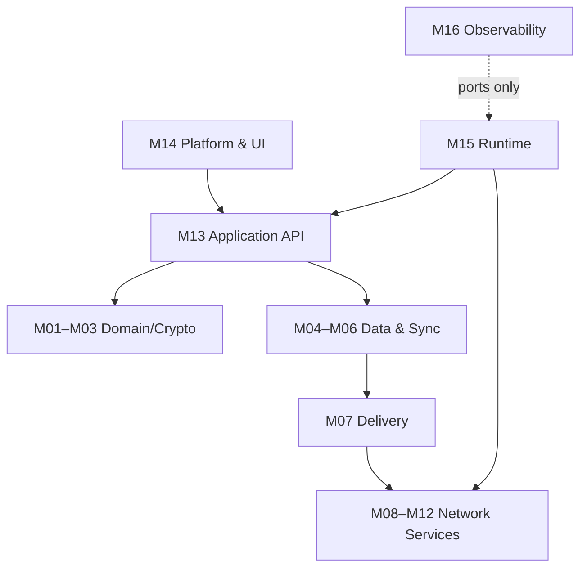

# 去中心化聊天系统：模块化实现设计

状态：`Draft / contract-first`

适用范围：MVP 至节点网络、群组与自动化阶段

目标：在不共享内部模型、不直接依赖彼此实现的情况下逐个交付可验证的纵向切片；多人协作时也使用同一边界。

## 1. 核心决定

1. **共享的是版本化契约，不是领域对象。** 每个模块拥有自己的状态、数据库表和内部类型。
2. **防腐层位于消费者一侧。** `A` 使用 `B` 时，由 `A/acl/b_adapter` 把 `B` 的 DTO 转为 `A` 的本地类型。
3. **同步调用只经过 Port；异步协作只经过耐久 Integration Event。** 禁止跨模块直接调用实现类型、访问表或订阅内部事件。
4. **网络、FFI、数据库、密码库类型不得越界。** 边界只传拥有所有权的 DTO、受限字节串、流句柄和稳定错误码。
5. **每个写模型只有一个逻辑写入者。** 并发通过分片、消息队列、幂等键和乐观版本推进，不通过跨模块共享锁解决。
6. **先冻结当前切片的最小契约，再实现。** 契约测试向量是合并门槛；实现可以替换，线格式不可悄然改变。尚未进入当前切片的模块只保留逻辑规格，不预建空 crate。

## 2. 文档导航

- [边界与防腐层规则](00-boundaries-and-acl.md)
- [Workspace 与代码所有权](01-workspace-layout.md)
- [共享协议内核](02-shared-protocol.md)
- [Port 依赖矩阵](interface-dependency-matrix.md)
- [并行工作包](concurrency-workplan.md)
- [跨模块契约测试](contract-test-kit.md)
- [需求—模块—测试追踪矩阵](traceability-matrix.md)

模块规格位于 [`modules/`](modules/)；每份规格均包含职责、非职责、函数签名、并发语义、限制、错误、ACL、测试和验收条件。

## 3. 模块目录

| ID | 模块 | 阶段 | 单一写模型 | 主要并发分片 |
|---|---|---|---|---|
| M01 | Identity & Device | MVP/Phase 5 | 身份、设备授权链 | `UserId` |
| M02 | Conversation & Policy | MVP/Phase 7 | 会话控制 Epoch | `ConversationId` |
| M03 | Crypto Orchestrator | MVP/Phase 7 | 会话密钥状态 | `(ConversationId, DeviceId)` |
| M04 | Event Store | MVP | 不可变事件日志 | `ConversationId` |
| M05 | Projection & Query | MVP | 可重建读模型 | `(ProjectionKind, ConversationId)` |
| M06 | Sync & Replication | MVP/Phase 8 | 同步游标和缺口 | `(PeerId, ConversationId)` |
| M07 | Delivery Scheduler | MVP | 投递 Job 状态机 | `DeliveryJobId` |
| M08 | Transport Session | MVP | 连接、流、握手 | `TransportPeerId` |
| M09 | Relay Service | MVP | 临时转发会话 | `RelaySessionId` |
| M10 | Mailbox Service | MVP | 密文信封、租约、游标 | `RoutingToken` |
| M11 | Discovery & Node Selection | Phase 3/8 | 节点目录和健康评分 | `NodeId` |
| M12 | Attachment & Blob | MVP（Phase 4.5） | 图片/小文件的加密清单和分块 | `BlobId` |
| M13 | Application API / FFI | MVP | 命令协调和 UI 流 | `ClientSessionId` |
| M14 | Platform & UI Shell | MVP/Phase 6 | 平台凭据引用、通知状态 | `PlatformProfileId` |
| M15 | Node Runtime & Role Host | MVP | 角色生命周期与配置 | `RoleInstanceId` |
| M16 | Observability & Abuse Control | MVP | 指标、配额、审计 | `(PolicySubject, Window)` |
| M17 | Backup & Recovery | MVP+ | 加密快照和恢复检查点 | `BackupSetId` |
| M18 | Automation & Capability | Phase 10 | Agent 授权和执行记录 | `AgentId` |

## 4. 依赖方向



图中的箭头表示“通过契约消费”，不表示实现 crate 依赖。`M17`、`M18` 通过 Application Ports 和 Integration Events 接入，不得成为核心发送链路的反向依赖。

## 5. 开发尺度与前置冻结项

模块首先是所有权、Port 和数据边界，不等同于 crate。独立开发者默认同时只推进一个端到端切片，另允许一个阻塞该切片的基础契约任务；其余工作保持在积压中。只有出现独立版本、独立依赖/feature、需要隔离 infra，或编译与所有权冲突时才拆出 crate。

当前切片编码开始前只冻结以下内容：

- ID 二进制/文本格式与最大长度；
- `EventEnvelopeV0`、签名覆盖范围与 canonical encoding；
- `OpaqueEnvelopeV0`、`DeliveryReceiptV0`；
- `RequestContext`、稳定错误码和重试分类；
- Port 的输入/输出 DTO 与流的背压规则；
- Integration Event 的 schema、幂等键和 outbox 语义；
- 固定测试向量和兼容性策略。

不应提前冻结：数据库索引、任务调度器实现、密码库内部状态、QUIC/libp2p 类型、Flutter 状态管理库或服务部署方式。

## 6. 合并门槛（Definition of Done）

每个模块必须：

- 只依赖允许的 `contracts-*`/`ports-*` 包；
- 通过本模块单元、属性、并发、故障注入和契约测试；
- 提供内存 Fake（行为正确）和故障 Stub（可注入超时/损坏/拒绝）；
- 对所有写操作声明幂等性、事务边界和崩溃恢复点；
- 对所有异步 API 声明超时、取消、背压与重试责任；
- 无跨模块数据库外键、共享事务、实现 crate 依赖或私有类型泄漏；
- 为 wire/persisted schema 提供向前兼容测试和固定向量；
- 将敏感字段从日志、指标和稳定错误消息中清除。

## 7. 规格约定

示例签名是契约草案，不等同于要求使用某个具体 async trait 宏。动态分发边界统一使用：

```rust
pub type BoxFuture<'a, T> =
    core::pin::Pin<Box<dyn core::future::Future<Output = T> + Send + 'a>>;

pub type BoxStream<T> =
    core::pin::Pin<Box<dyn futures_core::Stream<Item = T> + Send + 'static>>;
```

所有 DTO 默认 `Send + Sync + 'static`，不携带借用、锁守卫、数据库连接、Socket、密码库会话或 FFI 指针。
