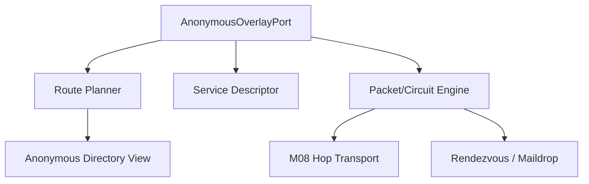
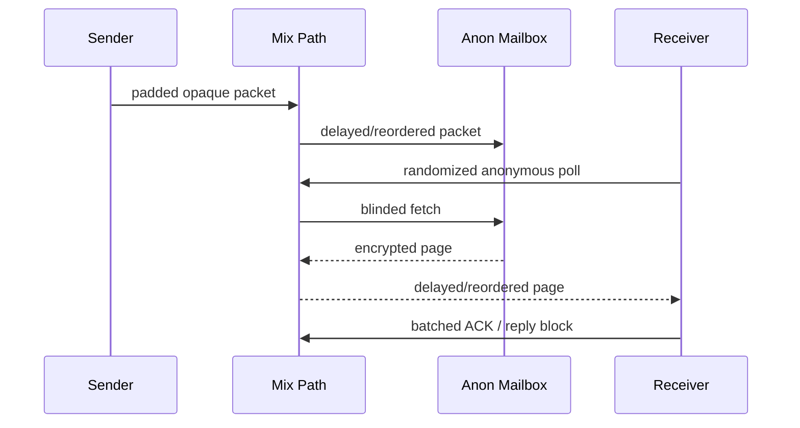

# 覆盖层架构与消息流程

## 1. 组件划分



### Route Planner

- 根据 privacy profile 和 purpose 选择 Onion 或 Mix。
- 使用稳定 Guard、operator/network diversity 和本地隔离状态。
- 不访问 ConversationId、UserId 或明文目标；只使用本地匿名 target handle。

### Service Descriptor Manager

- 生成时间 Epoch 盲化的服务索引。
- 加密 Introduction、Rendezvous capability 和 Mailbox 信息。
- 为不同联系人/会话提供不可关联的 descriptor access capability。
- 管理重叠发布和过期，防止时钟边界导致不可达。

### Circuit/Packet Engine

- Onion：逐跳握手、分层加密、固定/分档 cell、流控、关闭和重建。
- Mix：Sphinx 类 packet、延迟指令、重放防护、乱序重组和 SURB 类匿名回复能力。
- 只输入 M03 已加密信封，不解释业务事件。

### Anonymous Directory View

- 聚合 DHT/Gossip、Witness epoch 和本地历史。
- 验证 descriptor、角色资格、family、多样性和回滚。
- 与普通 M11 NodeDescriptor、NodeId 和健康分完全隔离。

## 2. 身份域

```text
UserId              长期业务身份
DeviceId            授权设备
NodeId              普通服务节点身份
AnonNodeId           匿名中继公开身份
AnonServiceId        被联系服务身份
DescriptorEpochKey  时间盲化描述符键
CircuitId            单连接局部随机 ID
ReplyBlockId         一次性匿名回复能力
AnonMailboxToken     轮换匿名投递 token
```

硬约束：

- 禁止 `AnonNodeId = hash(NodeId)` 或 `AnonServiceId = hash(UserId)`。
- 同一机器可运行普通和匿名角色，但必须使用不同密钥、监听端口、指标域和数据目录。
- `CircuitId/ReplyBlockId` 不得进入持久业务事件或普通 tracing。
- ServiceId 最好按联系人或会话隔离，而不是一个用户一个全局地址。

## 3. 封装顺序

```text
Event payload
→ M03 conversation E2EE
→ M00 OpaqueEnvelope
→ anonymous delivery tag / replay data
→ Onion 或 Sphinx packet layers
→ padded transport cell
→ M08 hop-to-hop encrypted link
```

内容密码密钥、路径密钥和逐跳传输密钥必须是三个独立域。任何一层的 key、nonce、domain separator 都不能复用。

## 4. 在线 Rendezvous 消息

### 接收端准备

1. 选择若干 Introduction 节点，并建立独立入站电路。
2. 为当前 descriptor epoch 生成 blinded service key。
3. 把 Introduction 信息、协议和授权要求放入加密描述符。
4. 向多个目录位置发布重叠 epoch 描述符。

### 发送端连接

1. 根据联系人持有的 capability 推导描述符索引并匿名查询。
2. 解密描述符，验证 service key、epoch、签名和 expiry。
3. 选择 Rendezvous 节点，经 Guard/Middle 构建独立电路。
4. 通过 Introduction 电路发送一次性 rendezvous request。
5. 接收端另建电路连接 Rendezvous。
6. Rendezvous 拼接两条电路，双方完成端到端会合握手。
7. M06/M07 在该匿名 stream 上发送 OpaqueEnvelope 和受限回执。

Rendezvous 只知道两条进入自己的匿名电路，不知道 UserId、ConversationId、正文或双方真实地址。

## 5. 离线匿名消息



Mailbox 语义继续遵守 M10：至少一次 fetch、本地 durable commit 后 ACK、EnvelopeId 去重。新增限制：

- token 不可与 UserId/DeviceId/普通 RoutingToken 关联；
- poll 使用独立电路且随机化批次，不按每条 Push 精确触发；
- page 使用固定条数/字节窗口或填充；
- ACK 批处理并允许随机延迟；
- 多 Mailbox 复制时不复用可关联的服务认证凭据。

## 6. Mix 模式

Mix 路径至少包含分层角色或等价的独立选择域：

```text
Entry/Gateway → Mix Layer A → Mix Layer B → Mix Layer C → Mailbox/Rendezvous
```

每个 Mix：

- 只知道前一 hop、后一 hop 和当前 packet delay instruction；
- 对 cell 做逐跳处理、重放检查、随机等待和乱序；
- 不保持聊天会话语义；
- 不能读取 OpaqueEnvelope；
- 按固定容量队列和延迟预算运行。

客户端与 Mix 可发送自注入 loop/cover packet，用于提高匿名集合并检测丢弃。cover schedule 必须使用独立隐私预算，不能因真实消息到来而出现明显突发。

## 7. 回执与回复

- Onion 模式可在同一 rendezvous stream 返回回执，但要按会话隔离。
- Mix 模式优先使用一次性 reply block/SURB 类能力，使接收者无需知道发送者返回地址。
- 一个 reply block 只能使用一次，绑定 packet class、expiry、最大响应尺寸和 audience。
- 回执只表示 M07 已定义的阶段，不把 Mailbox persisted 伪装成 device received。

## 8. 附件

附件体积是强侧信道，不能简单把 M12 大文件直接塞进 Mix：

1. AttachmentRef 和小型 manifest 走 Mix/Onion 消息。
2. ciphertext chunks 走独立 purpose 的 Onion circuit。
3. chunk 尺寸、请求窗口和并发采用少量公开档位。
4. Blob 服务只能看到 ciphertext ChunkId 和尺寸档位。
5. Strict Mix 可以限制附件大小、延迟窗口或明确声明无法提供同等级流量隐藏。

## 9. 移动端

- 手机只承担 Client/Light 角色，不作为公共 Guard、Mix、Introduction 或 Mailbox。
- 普通 Push 只能发送随机 WakeHint，但 Push 时间仍可能与网络事件相关。
- P3/P4 优先使用随机、批量、低频 poll；用户需理解电量和延迟代价。
- 后台预算不足时持久化匿名 poll checkpoint，不回退普通网络。
