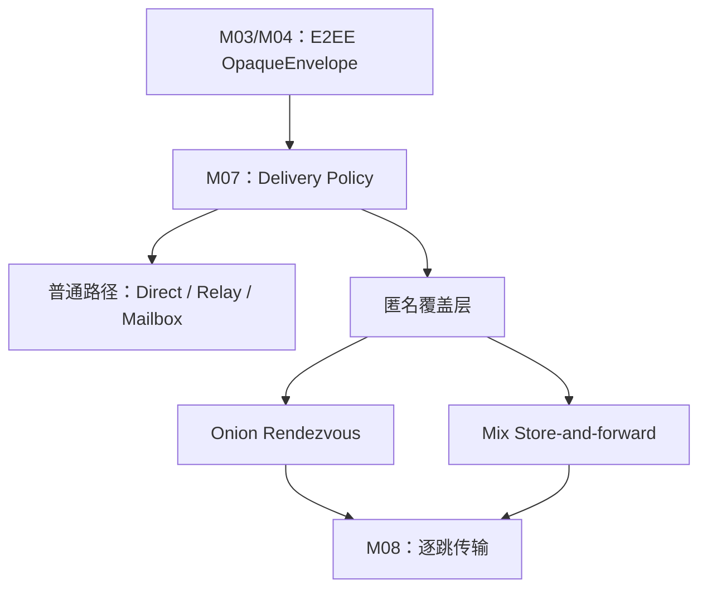

# 自组织匿名覆盖网络

状态：`Future / Exploratory / Non-binding`
文档日期：2026-08-02
前置条件：MVP 的 M00–M16 核心链路稳定
范围：匿名消息传输、接收方位置隐藏、离线匿名投递和自组织匿名节点网络

## 1. 核心结论

匿名能力应作为 M07 Delivery 与 M08 Transport 之间的独立覆盖层，而不是：

- 替换 M03 端到端加密；
- 把匿名协议字段写入 M04 事实模型；
- 让所有普通 Relay 自动变成匿名中继；
- 用随机多跳替代严格的路径选择和流量分析防护；
- 在匿名路径失败时回退到 Direct 或普通 Relay。

推荐形成两个互补数据平面：

1. **低延迟 Onion Rendezvous**：在线聊天、同步、交互式请求。
2. **延迟 Mix Store-and-forward**：文本、控制事件、回执和离线投递，对流量关联提供更强防护。



## 2. 文档导航

- [威胁模型与隐私档位](01-threat-model-and-privacy-profiles.md)
- [覆盖层架构与消息流程](02-overlay-architecture-and-message-flows.md)
- [自组织控制平面](03-self-organizing-control-plane.md)
- [模块集成与概念接口](04-module-integration-contracts.md)
- [路线图、测试与发布门槛](05-roadmap-tests-and-release-gates.md)
- [研究基础与参考资料](references.md)

## 3. 设计原则

### 3.1 匿名层与内容加密正交

M03 先生成已经端到端加密的 `OpaqueEnvelope`，匿名层再提供路径层封装。即使匿名层全部被攻破，中继仍不能读取正文；即使内容密码学完好，也不能因此宣称网络关系匿名。

### 3.2 无通用 Exit Node

系统只连接聊天网络内部的服务描述符、Rendezvous 和 Mailbox，不提供任意互联网出口。这样可以减少出口节点观察目的地址和承担第三方流量风险，同时更适合端到端的双边匿名会合。

### 3.3 强模式不可静默降级

当会话选择 Onion 或 Mix 模式后：

- 禁止 Direct、普通 QUIC、普通 Relay、普通 Mailbox 自动兜底；
- 禁止在 UI 未确认时切换隐私档位；
- 匿名路径不可用时保持本地已提交、网络排队；
- 降级必须产生明确、可审计、不可伪装成成功的状态。

### 3.4 自组织不等于无控制面

节点可以自行加入、发现和承担角色，但路径安全仍需要：

- 有界且可验证的网络视图；
- Guard 稳定性；
- operator/network diversity；
- 描述符防回滚和等价攻击；
- 抗 Sybil、Eclipse、路径偏置和选择性失败；
- 多个相互独立的目录 Witness。

早期阶段允许弱联邦控制面，前提是它不拥有用户身份、不承载所有流量，并且可由多个独立运营者替换。

### 3.5 不夸大匿名保证

任何发布说明必须明确对手范围。低延迟 Onion 主要防御单个中继、接收方直接获知来源地址和局部网络观察者；它不自动抵抗全球被动观察者的时间/流量关联。只有引入混合延迟、填充、cover traffic 和足够匿名集合后，才讨论更强流量分析防护。

## 4. 与当前路线的关系

```text
MVP：E2EE + Direct + Relay + Mailbox
  ↓ 稳定后
AN0：匿名接口与禁止降级语义
  ↓
AN1：现有匿名网络 Adapter / 低延迟验证
  ↓
AN2：自有 Onion 数据平面
  ↓
AN3：匿名服务描述符与 Rendezvous
  ↓
AN4：匿名 Mailbox
  ↓
AN5：Mix、延迟、填充和 cover traffic
  ↓
AN6：抗审查 Bridge 与传输伪装
```

匿名网络不应成为 MVP 的前置依赖；禁用整个匿名覆盖层后，普通 E2EE 聊天必须保持完整可用。
